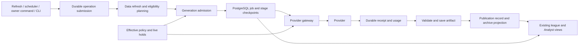

# Admin configuration and generation process hardening

**Date:** 2026-09-30

**Status:** Proposed design; incorporates three independent review passes. Implementation has not started.

**Code baseline:** `46465901dadd94e56fac4959f03e237ec35901ea`

**Scope:** Shared administration and execution controls across supported leagues, seasons, features, and entry points.

## 1. Intent and decisions

Make routine league operation predictable: refreshing data, restarting the app, changing configuration, or encountering a failed AI response must not silently purchase the same work again. An administrator must be able to explain every paid call, stop new calls, understand blocked work, and recover without discarding already purchased results.

The user requested process hardening before choosing dollar caps. This design therefore establishes ownership, authorization, bounded work, durable results, and accounting first. It leaves daily/monthly dollar amounts undecided. Process controls reduce leakage; they do not guarantee a fixed bill without spending ceilings, nor do they control every infrastructure charge.

Working decisions for this design:

- Retain the existing app-owner administrator role. League commissioners receive no new administrative authority. Broader delegation is a separate product decision.
- Use the existing PostgreSQL database and application worker loop. Do not add Redis, a queue vendor, or a generic workflow/rules engine.
- Keep data refresh and paid generation separate. A refresh can identify eligible work; only the generation admission service can authorize it.
- Treat jobs, provider attempts, receipts, and artifacts as durable records outside rebuildable caches.
- Ship ownership, live policy checks, provider accounting, stage checkpoints, and publication protection as one complete execution path. Partial infrastructure may merge disabled; it cannot execute paid work.
- Preserve saved Analyst editions, original text, corrections, sources, and public-share behavior. Existing prose must be imported, not repurchased.
- Keep all production controls unchanged while this design is reviewed. A later release requires a confirmed Railway target and a concrete activation checklist.

Approval of this document will establish the design. A task-level implementation plan will then specify migrations, interfaces, test fixtures, and commit-sized changes before product code is written.

## 2. Evidence and the failure mechanisms

The investigation's September 30 snapshot estimated **$84.81 across September 27–30**, including **$65.39 for Analyst generation and review** and **$17.77 for trade stories**. These are application ledger estimates, not a reconciled provider invoice, and exclude Railway hosting. Historical Analyst failures repeatedly re-entered scheduled generation. One observed league refresh window produced 990 trade-story calls across overlapping batches and retries.

The current code at the baseline has several independent openings:

| Opening | Relevant current code | Required change |
|---|---|---|
| GET refresh starts work tied to an SSE connection; cancelling its coroutine cannot reliably stop an already running provider thread | `api/app/routes/refresh.py`, `web/lib/api.ts` | Submit a durable job with POST; subscribe separately; cancellation is an explicit command |
| Every process starts background refresh loops; concurrent refreshes can purchase overlapping work | `api/app/main.py`, `api/app/services/refresh_service.py` | Database deduplication, ownership, and global admission |
| Trade prose lives in ChainCache and is saved after a larger grading run completes | `api/app/services/grader.py`, `story_gen.py`, `chain_cache.py` | Save each artifact independently; rebuild cache projections from it |
| Analyst can make up to six calls in one current workflow; cooldowns eventually repeat without a terminal attempt limit | `src/sleeper_dynasty/llm/recap_writer.py`, `api/app/services/analyst_store.py` | Checkpoint each stage, reduce the proposed default to one repair, stop exhausted work |
| Some cost recording happens after parsing; failures and CLI paths can escape attribution | `src/sleeper_dynasty/llm/`, `src/sleeper_dynasty/cli.py` | One mandatory provider adapter records attempts and raw receipts |
| Budget lookup can fall back after database errors; UI and worker configuration differ | `api/app/services/refresh_service.py`, `api/app/routes/settings.py`, `api/app/routes/admin.py` | One policy resolver; paid work fails closed when authoritative policy is unavailable |
| Missing capability fields can become full dynasty support, including truthy malformed booleans | `src/sleeper_dynasty/engine/capabilities.py` | Strict, evidence-backed eligibility for paid features |
| League inventory depends on membership/cache presence; provider IDs can change between seasons | `api/app/routes/admin.py`, `api/app/repositories/memberships.py` | Persistent league-series and season registry |
| Database restore can forget already purchased work, and database/archive backups are not one atomic snapshot | `api/app/services/backup_service.py`, `scripts/restore.py` | Restore quarantine, reconciliation, and a tested backup contract |

The frontend currently closes its EventSource on errors. This design does not attribute the incident to an automatic browser reconnect loop. Disconnects, manual retries, concurrent schedules, and worker restarts are sufficient reasons to remove request-owned execution.

This spec supersedes the refresh-triggered AI execution and cache-owned prose assumptions in the earlier cost-control and settings-gating designs. Their historical approved status does not authorize a bypass of the controls below.

## 3. Architecture and alternatives

**Recommended: PostgreSQL-backed operations with a fixed feature registry.** The app already relies on PostgreSQL for durable user data. Put the small job state machine, policy revisions, attempts, and artifacts there, and run a bounded worker alongside the existing app. Multiple replicas remain safe through database constraints and transactional claims.

Two alternatives were considered:

- **Add throttles and locks to the current refresh path:** smaller patch, but cannot reliably recover purchased stages, separate cache invalidation from generation, or establish one authorization and accounting boundary.
- **Adopt an external workflow platform:** can provide durable orchestration, but adds infrastructure and still requires this app's semantic deduplication, provider ambiguity handling, permissions, and migration. Reconsider only if operational scale justifies it.

The browser observes durable state. It does not own the job. A worker owns a lease, but only the current lease generation may start a new paid stage or publish. A provider response may arrive after that ownership ends; its usage still belongs in the ledger.

## 4. Non-negotiable execution rules

| ID | Rule |
|---|---|
| R1 | A cache miss, GET request, deploy, schema bump, or prompt-version change cannot by itself authorize a paid call. |
| R2 | Every provider HTTP attempt has a committed attempt record, a registered feature, a stable subject, an authorization, and an actor or scheduler principal before network submission. |
| R3 | Duplicate triggers join existing work. Only one unsettled attempt for a subject's generation may exist at a time. |
| R4 | Completed stages and paid artifacts survive process loss and cache deletion. Recovery resumes from persisted work. |
| R5 | An ambiguous provider outcome blocks automatic resend. Lease expiry or elapsed time is not evidence of non-execution. |
| R6 | A committed pause prevents new permits. Already admitted calls can finish and be accounted for; pause cannot undo provider billing. |
| R7 | Retry and repair allowances belong to the durable authorization. Requeueing, configuration changes, and restarts cannot replenish them. |
| R8 | Publication is idempotent, tied to the validated content digest, and conditional on the expected current revision. |
| R9 | Unknown capabilities, unavailable policy, revoked permissions, and unregistered features cannot authorize paid work. |
| R10 | All settings surfaces use the same effective configuration and expose its origin and revision. |
| R11 | Retired leagues, removed memberships, and failed jobs retain their accounting and administrative visibility. |
| R12 | Restore and mixed-version rollout cannot silently reactivate legacy generation. |

## 5. League identity and capability model

Introduce `league_series` for a continuing competition and `league_seasons` for provider-specific season identities. A season stores provider, opaque provider league key, season year, verified predecessor evidence, normalized capabilities, and the time/source of that evidence. Existing routes can continue accepting their current league identifiers through this mapping.

Constraints:

- The pair `(provider, provider_league_key)` maps to exactly one season record. The provider's confirmed history/renewal chain establishes series continuity; names and shared members do not.
- An unverified renewal remains a separate pending mapping. The owner can resolve it through an audited operation with a preview of policy and artifact effects. No automatic series merges.
- Persistent policy and pause settings attach to the series. Seasonal facts, evidence, provider permissions, and capabilities attach to the season and are rechecked.
- Provider transaction identity plus its originating season identifies a trade. Traversing a later season's history cannot create a second subject for that same trade.
- Owner identity changes preserve historical subject/artifact identity. They can invalidate a data projection without authorizing new prose. Conflicting identity mappings hold affected jobs for review.
- Registry lifecycle is `active`, `retired`, or `pending_verification`. Removing the last membership holds new work and retains the registry, artifacts, and ledger. Re-adding a member does not automatically clear a prior hold.

Capabilities are strictly typed, with explicit `unknown` where evidence is missing. Track format (`dynasty`, `keeper`, `redraft`, `unknown`), roster continuity, future-pick support, multiyear history, completed-result coverage, and supported feature adapters. Malformed values such as the string `"false"` fail validation. Absence is never implicit permission.

Paid eligibility uses feature-specific requirements, not a blanket dynasty fallback. Dynasty, keeper, and redraft profiles configure only supported features. A keeper league without demonstrated future-pick support cannot inherit future-pick claims. Yahoo initially retains its current Analyst restriction until its adapter has the requisite evidence and its own acceptance tests. Adding a platform does not automatically enable paid features.

Historical season status comes from that season's evidence. A current NFL week must not relabel an imported historical league as current or eligible for a new weekly edition.

## 6. Configuration and authority

Use a fixed, typed schema rather than arbitrary key/value rules. The normal resolution order is:

1. Registered feature defaults.
2. App-wide feature settings.
3. One assigned league-format profile.
4. Explicit league-series overrides.

Then intersect the result with live app/provider/feature/series holds, platform support, verified season capabilities, permissions, and hard process limits. Lower-level overrides cannot weaken these gates. Environment configuration supplies bootstrap defaults and an emergency deny switch; it cannot turn generation back on against a database pause.

Every resolution returns the value, originating layer, policy revision, and any blocking reason. The worker, admin API, cost/settings API, and preview UI call this same resolver. Unknown keys, invalid enum values, negative limits, and malformed booleans are rejected. Errors cannot be converted to unlimited operation.

Version-one settings include:

| Area | Typed controls and behavior |
|---|---|
| Activation | App, provider, feature, and series pause; explicit activation timestamp |
| Feature behavior | Disabled / manual / eligible automatic; model per stage; approved model allowlist; bounded facts/prompt size and maximum output tokens |
| Data refresh | Schedule, minimum interval, one active refresh per season, adapter timeouts and bounded pagination |
| Generation | Feature eligibility rule, maximum stages/repairs, shared concurrency, per-series concurrency, queue bounds |
| Profiles | Versioned dynasty, keeper, and redraft settings; assignment is explicit and inspectable |
| Lifecycle | Active/retired state, activation watermark, missing-capability and provider-grant holds |

Proposed conservative launch defaults are **one globally in-flight paid request**, **one in-flight paid request per series**, and **one queued desired generation per subject**. The owner may later increase concurrency within tested application ceilings. Waiting jobs consume no provider calls. A stale or unreachable worker cannot free an unresolved attempt's concurrency slot just by losing its lease.

These are admission limits; the provider's actual state can be unknown after a lost response. Uncertainty resolution can release a slot only on evidence of completion/non-submission, or through an explicit owner decision to abandon waiting after the original sending process is confirmed stopped. Revoking its database lease alone is insufficient because it may already hold a committed permit. That exception retains unknown usage and acknowledges possible remote overlap. It is separate from authorizing any replacement generation; ordinary resume/force cannot perform either action implicitly.

Keep existing monetary settings visible during migration and preserve any configured nonzero limit as an additional stop signal. Do not choose new amounts or claim that the legacy month-to-date check is a hard ceiling. An unavailable budget/policy value blocks paid admission. Exact atomic monetary reservations belong to the later caps phase.

Configuration writes require `expected_revision` and an audit reason. The server commits the settings revision and audit event together; a stale edit returns a conflict. Bulk changes first produce a preview bound to the affected series IDs and configuration revisions. Applying a stale preview returns a conflict and requires a new preview.

### Permissions

| Action | Ordinary authorized member | App-owner administrator | Scheduler |
|---|---|---|---|
| Read league data and published content | Existing access rules | Existing access rules | No browser role |
| Request/join data refresh | Yes, bounded and deduplicated | Yes, same bounds | Only eligible active seasons |
| Create paid authorization directly | No | Yes, subject to all live gates | Only registered automatic eligibility rules |
| Change policy, resume, force regeneration, backfill, resolve uncertainty | No | Yes, audited and scoped | No |
| Read cross-league costs, raw receipts, audit history | No | Yes | Service access only |

Membership alone cannot invoke `force` or purchase historical regeneration. Free refresh requests do not directly call the AI queue; the registered planner independently evaluates eligible business events. All GET endpoints remain read-only, including cold-cache and progress paths. State-changing endpoints use the app's authenticated mutation protections and rate limits.

Manual Yahoo jobs retain the requesting user and connection generation. At execution, recheck that user's membership and current provider grant. A lost grant cannot fall back to some other member's credentials. Scheduler jobs have an explicit scheduler principal and use the existing verified-member selection policy, recording which connection generation was selected. Never store access tokens in jobs or logs.

## 7. Eligibility and regeneration authorization

Three identities serve different purposes:

- **Subject:** stable business item, such as a trade, an owner-season summary, or a season-week Analyst edition.
- **Request snapshot:** exact facts, identity version, prompt/template version, model, settings revision, and parent artifact digest needed to reproduce a stage.
- **Generation authorization:** permission to create one bounded generation for a specified business reason. Its unique key includes subject, reason, and semantic event/version; it is not merely a hash of every input field.

This prevents a price update, display-name change, model change, or irrelevant settings edit from creating an entirely new allowance. Request snapshots change only before work starts or through a new explicit authorization. Failed subjects remain held until the owner resolves the problem; new source hashes cannot hide an exhausted attempt history.

Proposed automatic rules for launch:

| Feature | Automatic event | Regeneration rule |
|---|---|---|
| Trade story | A newly observed eligible transaction after activation | One initial story; subsequent rewrites require an owner-approved campaign in version one |
| GM rating and franchise blurbs | First eligible current-season summary, then newly completed regular-season week | At most one generation per owner/feature/season/week; coalesce to the newest eligible week before admission |
| Analyst | A newly completed eligible regular-season week with verified results | One edition; a failed paid upgrade enters attention state; historical catch-up and factual corrections are explicit |

These are proposed defaults, not descriptions of today's behavior. Data grades and standings continue updating even when existing prose is retained. Show the prose's generation time and source period; do not label old prose as freshly generated. Correcting a factual error can hide the affected prose or show verified results immediately without another paid call.

At activation, record the observation watermark and manifest of existing subjects. Newly imported historical transactions and missed prior weeks are a proposed backfill, not new automatic work. For a new league the owner previews its initial content set before enabling it. An initial current-season summary is one explicit activation item, not permission to rewrite every historical owner summary.

Pause/resume retains queued state but does not replay missed intervals. On resume, rerun eligibility and coalesce ordinary summaries; older missed editions and trades remain a backfill proposal. A backfill campaign records exact subjects, reason, request versions, maximum physical calls, admission concurrency, and the approving actor. Growing the set requires another preview and approval. Exhausted items never restart when a campaign is reopened.

## 8. Durable data model and ownership

Add separate tables beside existing identity data; do not rewrite user or membership identities to deploy this system.

| Record | Responsibility and critical constraints |
|---|---|
| `league_series`, `league_seasons` | Verified identities, lifecycle, capabilities, activation watermarks |
| `policy_revisions`, `policy_assignments` | Immutable typed settings revisions and current assignments; compare-and-swap updates |
| `generation_authorizations` | Subject, business reason/version, actor, campaign, bounded allowances, terminal hold; unique semantic authorization key |
| `operations` | Data refresh or generation job, status, requested snapshot, scheduling time, lease owner/generation, heartbeat; unique active work key |
| `operation_stages` | Draft/review/repair checkpoints, input/output digests, completed receipt, validation outcome; unique operation and stage ordinal |
| `provider_attempts` | One physical HTTP attempt, pre-send permit, timestamps, request digest, provider request ID, outcome and usage state |
| `provider_receipts` | Durable raw response/status and normalized usage, attached once to an attempt; raw content restricted to operators |
| `content_artifacts`, `artifact_heads` | Immutable prose/facts/validation records and current subject pointer with expected-revision update |
| `publication_outbox` | Idempotent projections into existing archive formats, with stable artifact identity and destination revision |
| `admin_audit_events`, `telemetry_outbox` | Durable actions and state transitions; idempotent external telemetry delivery |

An authorization's counters and the attempt row are updated in the same transaction that grants submission. Claim jobs with row locking and `SKIP LOCKED`; use unique constraints as the final defense against duplicate producers. Each claim increments a monotonic lease generation. A stale worker cannot advance stages, authorize a call, move the artifact head, or publish through a stale generation.

Keep database transactions short; never hold a transaction open during provider network I/O. Scope lock ordering consistently: global/provider gates, series gate, authorization, operation, then attempt. Admission, pause, and permission-sensitive changes use the same relevant locks so their ordering is defined.

Before an HTTP send, the gateway transaction revalidates ownership, live gates, actor/grant, stage allowance, and concurrency, then marks the attempt `dispatching`. This commit is the admission boundary. A pause that commits first prevents the permit. A pause that commits second reports this attempt as already admitted; there is no claim of atomicity between a database commit and an external network send.

### States and recovery

Jobs use `queued`, `running`, `held`, `needs_attention`, `succeeded`, `cancelled`, and `superseded`. Holds have explicit reason codes such as `app_paused`, `provider_auth`, `capability_unknown`, `membership_removed`, or `restore_quarantine`.

Attempts use `prepared`, `dispatching`, `received`, `not_submitted`, `rejected`, `unknown`, and `abandoned_unknown`. The last state requires the explicit owner uncertainty decision described above; it never means unbilled. A later authentic receipt can settle it. Usage independently records `known`, `unknown`, or `pricing_unknown`. Business validation can fail even when an attempt completed and incurred known cost.

- Expired lease with no admitted attempt: another worker can claim and continue.
- Completed receipt/checkpoint: repeat local validation or publication, never the provider stage.
- `dispatching` without a durable receipt: mark unknown and hold the subject. A crash just before sending can produce a conservative false hold; that is preferable to an automatic duplicate purchase.
- Provider accepted a call but response was lost: reconcile only with trustworthy provider evidence. If reconciliation is impossible, retain uncertainty. An owner may explicitly authorize a new attempt acknowledging possible duplicate billing; the old attempt and potential cost are never erased or marked free.
- Late response after lease loss or cancellation: accept its receipt and usage idempotently; do not advance or publish from the stale worker. A current recovery worker may validate the stored result under current policy without resending.
- Permission removal or cancellation: prevent later stages, retain receipts and saved content. Cancellation does not promise a refund or terminate an already submitted provider request.

No exactly-once external execution guarantee is assumed. The enforceable guarantee is no automatic resend of an unresolved physical attempt and no duplicate publication from replayed local work.

## 9. Mandatory provider gateway and bounded stages

All four writer families, Analyst draft/review/repair, admin actions, schedules, and CLI commands use the same gateway. The feature registry declares its subject type, capability requirements, legal stages, model choices, token limits, and validation contract. Unregistered features cannot submit provider requests.

Writers build requests and validate responses; they do not construct provider clients. Disable SDK retries explicitly. Capture HTTP status, provider request ID when available, raw response, token dimensions, model identity, and timestamps before business parsing. Verify malformed-response capture against the actual locked SDK transport rather than assuming a successful typed SDK object will always exist.

If durable receipt persistence fails after provider submission, the pre-existing attempt remains unresolved and blocks resubmission. Do not report a successful accounted call or silently discard the accounting error. A late receipt can settle the record without a second charge entry. External telemetry is asynchronous through an outbox, never the authoritative ledger.

Use integer micro-USD for monetary aggregates with an immutable pricing snapshot and explicit rounding rule. Retain ordinary input, output, cache-write, and cache-read dimensions separately. Unknown model pricing is visibly unknown, not a guessed fallback price. Historical JSONL imports are marked legacy estimates; missing request IDs or usage are not manufactured.

Admission requires known pricing for the configured model and bounded request size. If the response unexpectedly reports a model/usage dimension without pricing, preserve the receipt, mark pricing unknown, and hold subsequent paid stages until reconciliation. Do not retroactively present the request as free.

Proposed stage limits per authorization:

| Workflow | Maximum paid stages | Terminal behavior |
|---|---|---|
| Trade story or either blurb | Initial draft plus one targeted repair after deterministic validation failure: at most 2 physical calls | Retain prior valid prose or verified data; mark attention if still invalid |
| Analyst | Draft, factual review, one targeted repair, review of the repaired draft: at most 4 physical calls | Publish only approved content; otherwise retain verified results and mark attention |

All physical sends count against the allowance, including failed provider requests. Version one performs no automatic HTTP retry. Local validation, checkpoint persistence recovery, and idempotent publication may retry without buying another response. An owner-authorized retry is explicit and bounded; it cannot silently reset the original counter.

Authentication failures open a provider-wide hold. Rate-limit responses record a shared `Retry-After` cooldown; it prevents other jobs from immediately repeating the rejected call, but does not automatically retry the failed attempt. Timeouts, connection failures after possible submission, and ambiguous server failures enter attention/unknown handling. `not_submitted` requires proof no request was dispatched. An authoritative provider rejection uses `rejected` and still counts as a physical send; zero usage requires evidence from the provider's response or billing contract.

Bounded attempts per subject do not stop the same defective prompt from failing across hundreds of subjects. Add a shared feature circuit breaker: the proposed default holds that feature after three consecutive terminal generation failures under the same deployed validation contract. Counters persist across restarts, and changing configuration does not reset an open breaker. Provider-auth failures and accounting-persistence failures open their relevant gate immediately. The owner sees the common error and must resolve/reopen the breaker; opening it does not reset failed subjects or buy replacements.

Review approval binds to the exact draft digest, fact snapshot, and review schema. Editing or repairing a draft invalidates the old approval. Normalize harmless whitespace/punctuation locally for matchup coverage, using stable matchup identifiers in structured output where practical. Such formatting errors must not require a wholesale regeneration or weaken factual validation.

## 10. Artifact durability and publication

PostgreSQL holds the canonical generated artifact and its facts/validation metadata. ChainCache becomes a disposable projection that references or copies durable prose. Losing a chain file, changing its schema, or rebuilding owner display information cannot remove the underlying paid content.

Import existing trade stories and blurbs before turning on the planner. Preserve original text and available hashes/versions with explicit legacy provenance. Missing generation metadata is a migration issue, not permission to rewrite. Import all Analyst originals and corrections, keeping revision order, correction notes, sources, and public-share bindings.

For Analyst compatibility, publish database artifacts into the current immutable archive through the outbox:

1. Commit the artifact, approved digest, expected prior revision, and outbox item together.
2. The projector writes the assigned immutable revision using a stable artifact ID and digest, then verifies it.
3. It marks the item delivered. Replaying the same item compares the existing destination and succeeds without creating another revision.
4. A different existing digest or unexpected prior revision is a conflict requiring attention; never overwrite it.

Publication does not run the writer. An old delayed upgrade cannot replace a newer correction. Pause stops new provider permits; it may allow accounting and local publication of already approved work if current permissions and expected revision still permit it. Explicit cancellation blocks publication of that cancelled job unless the owner later adopts its saved result through an audited action.

Before migration, fingerprint originals, revisions, share mappings, and chain prose. Compare counts and hashes after import and before activation. Keep legacy files readable through the transition; do not delete source archives as part of this work.

## 11. API and admin experience

Replace execution through GET with explicit submission and read-only observation:

- `POST /api/league/{league_id}/refresh-jobs` submits or joins bounded data refresh and returns an operation ID.
- `GET /api/league/{league_id}/jobs/{job_id}` returns status; the corresponding `/events` endpoint streams persisted progress without starting work.
- `POST /api/admin/generation-jobs` creates a scoped manual generation authorization.
- `POST /api/admin/jobs/{job_id}/cancel` prevents later stages; actions to reconcile or authorize a new attempt have separate explicit bodies and audit reasons.
- Policy reads include effective settings and provenance. Policy writes and campaign applies require their preview/settings revision.

Require authorization against the job's actual league, not just a caller-supplied URL. Use a scoped idempotency key for submission, with a payload digest so reusing a key with different parameters returns a conflict. Server semantic deduplication remains necessary even when clients choose different keys. Do not expose owner-only prompts, receipts, grant details, or cross-league costs through member progress endpoints.

Cold-cache UI automatically submits a data-only refresh once and reconnects to the resulting job. Update both DashboardClient and manual refresh behavior. Retire legacy GET execution in a staged compatibility release: old clients receive an explicit upgrade/refresh response, never an adapter that secretly starts a job on GET.

Extend the existing admin area with five views:

1. **Overview:** effective pause state, current jobs, known spend, unknown attempts, blocked reasons, and provider/accounting health.
2. **Leagues:** active, retired, and pending series; season mappings, capabilities, selected profile, effective settings and their source, last free refresh, and last generated artifact.
3. **Jobs:** requested reason and actor, saved stages, physical calls, known/unknown cost, artifact links, and a precise next action. Refresh status is separate from prose status.
4. **Configuration:** defaults, profiles, overrides, model per stage, before/after preview, affected league counts, and stale-edit conflict handling.
5. **Audit and recovery:** configuration history, campaigns, pause/resume, cancelled work, uncertainty resolution, migration/restore holds, and reconciliation results.

Use specific errors: “Review response was not received; the provider may have processed it. Generation is held to avoid a duplicate call.” Avoid a generic Retry button that hides a possible second purchase. Administrative “force” means a new scoped authorization; it never bypasses pause, permission, uncertainty, concurrency, or stage limits.

## 12. Other resource leakage and observability

Separate data-refresh controls matter even where no AI is involved. Deduplicate full refreshes across replicas and callers, bound provider pagination and network retries, honor provider cooldowns, reuse incremental caches, and cap outstanding refresh work per season. Polling uses job versions or SSE; it cannot rerun grading. Startup performs normal bounded scheduling without a full historical catch-up.

Log operation, stage, attempt, series/season, policy revision, lease generation, actor type, result, and reason code for key transitions and external calls. Do not log secrets or raw prompts to routine application logs. Member-facing errors remain narrower than owner diagnostics.

Expose metrics for physical calls per published artifact, repaired/failed generations, reused artifacts, coalesced jobs, blocked duplicates, unknown outcomes, queue age, stuck publication, provider errors, and free-refresh duration/request counts. Health alerts identify failed invariants or sustained failures; monitoring must not trigger a paid diagnostic retry.

Keep artifacts, approvals, usage, audit records, requests, and receipts durable in version one. Use bounded payload sizes and paginated admin queries, and report database/backup growth. A later retention policy may compact settled transport-only diagnostics while preserving facts and accounting; no automatic deletion is introduced by this design.

This work does not claim to solve all Railway, storage, egress, or third-party subscription costs. Its operational dashboard should distinguish measured provider usage from infrastructure costs; dollar caps and infrastructure limits remain a separate follow-up.

## 13. Rollout, backup, and rollback

Build and test offline with a fake provider. No live paid test is needed to prove concurrency, crash recovery, or duplicate prevention.

The deployment sequence is mandatory:

1. Add schema and read-compatible code with paid execution disabled. New tables preserve existing accounts, memberships, grants, bets, archives, and shares.
2. Import and fingerprint existing artifacts, registry mappings, current policy, and legacy estimated costs. Produce a reconciliation report; unresolved records remain held.
3. Move every provider entry point to the gateway, including CLI and maintenance scripts. Lock runtime dependencies and test the built image's actual transport/retry behavior.
4. Before activation, drain or stop old workers and old paid jobs. A new database pause cannot control old code. Use a release maintenance window and remove/revoke legacy provider credentials if old processes cannot be conclusively drained; provision usable credentials only to the migrated deployment.
5. Deploy compatible API and Web together, verify cold-cache and observation behavior with generation paused, and confirm the running commit and schema version.
6. Preview initial eligible content for a narrow series/feature cohort. The owner explicitly activates it. Verify operation-to-attempt-to-artifact accounting before expanding activation; no automatic historical backfill.

Backup support must round-trip the exact chosen database types, immutable artifacts, policy revisions, attempts, usage, and outboxes. The existing scalar whitelist must be extended if new JSON or other types are introduced. Record backup revision, snapshot time, artifact manifest, and checksums. Archive projections can be rebuilt from canonical database artifacts, but missing legacy archive data is not silently reconstructed with AI.

Restore always starts in generation quarantine. The restore process must disable execution and remove usable provider credentials before restored app startup; a pause row inside the restored database is insufficient because it may itself be stale. Create a new execution epoch and classify restored in-flight attempts as unresolved. Reconcile the post-snapshot interval against retained newer evidence/provider records before re-enabling affected subjects. If no trustworthy evidence exists, keep the uncertainty and require an explicit duplicate-risk decision for a new authorization.

Rollback targets only a gateway-compatible release. A legacy rollback requires generation disabled and provider credentials unavailable. Never use reverting migrations or deleting job records as recovery. Reconcile any admitted requests and retain accounting before changing execution ownership.

## 14. Delivery plan and release gates

These phases are implementation boundaries, not permission to activate an incomplete paid path. Each phase gets a task-level plan and meaningful tests. Phases 1–3 form the required backend core; phase 4 supplies the operator controls needed before production activation.

| Phase | Deliverable | Main code areas | Exit evidence |
|---|---|---|---|
| 1. Contracts and persistence | Registry, typed policy, permissions, semantic authorizations, job/attempt/artifact schema and backup support | `api/app/db/`, `api/migrations/`, new focused `api/app/services/generation/` and repositories; `engine/capabilities.py` | Migration preservation, policy conflict tests, strict capability fixtures, native PostgreSQL deduplication |
| 2. One complete execution path | Claim/fencing, gateway, receipts, bounded Analyst stages, artifact and outbox publication | New generation services; `llm/recap_writer.py`, `analyst.py`, `analyst_store.py` | Fake-provider crash matrix proves no duplicate sends or publications; no paid production activation |
| 3. Complete caller migration | Trade/blurb writers, refresh separation, scheduler admission, CLI, existing artifact import | `grader.py`, `story_gen.py`, `blurb_gen.py`, `franchise_blurb_gen.py`, `refresh_service.py`, `analyst_scheduler.py`, `main.py`, `src/sleeper_dynasty/cli.py` | Every physical send has a prior durable permit; cache deletion reuses artifacts; zero legacy bypasses |
| 4. Admin and client integration | Effective policy UI, league registry, jobs, campaigns, audit, POST submission and read-only progress | `routes/admin.py`, `routes/settings.py`, `routes/refresh.py`, `web/app/admin/`, `web/components/admin/`, refresh clients | Permission, stale-preview, job visibility, cold-cache, and responsive browser tests |
| 5. Operational verification and controlled activation | Built-image tests, restore rehearsal, legacy-worker drain, production read-only verification, cohort activation | `api/Dockerfile`, dependency lock, CI, backup/restore scripts, release runbook | All acceptance scenarios pass; exact release verified; no unresolved migration items in activated cohort |
| Later. Dollar ceilings | Atomic shared reservations and configurable daily/monthly caps with provider-side limits where available | Existing gateway admission and usage records | Separate design with user-selected amounts and timezone/reset semantics |

Additive modules should remain focused: policy resolution, admission, job ownership, provider transport, accounting, artifact storage, and publication each have one responsibility. Do not grow a single all-purpose refresh service or introduce configurable arbitrary workflows.

## 15. Acceptance tests and review traceability

Concurrency assertions must run against real PostgreSQL. SQLite and mocked repository methods cannot prove the locking behavior. Provider tests use a controllable fake HTTP transport that records every physical request and can stall, accept-then-drop, return malformed bodies, or produce a late response.

| Test | Adversarial scenario | Required observable result | Rules |
|---|---|---|---|
| A1 | Two API replicas, a scheduler, and repeated browser submissions target the same subject | One authorization/active generation and one physical call for each permitted stage | R1–R3 |
| A2 | Disconnect SSE while provider is blocked; another watcher attaches | Work remains owned by its durable job; attachment sends no request | R1–R4 |
| A3 | Revoke a lease/cancel, then let its provider response arrive | Usage recorded once; stale worker cannot start a stage or publish | R3–R6 |
| A4 | Provider accepts a call and drops the response before returning an ID; restart repeatedly | Unknown state survives; zero automatic resends or allowance resets | R4, R5, R7 |
| A5 | Crash immediately before/after each attempt commit, response receipt, checkpoint, and publication | Completed stages are reused; ambiguous sends held; publication replays without new revision | R2–R5, R8 |
| A6 | Review approves draft A; repaired draft B has a different digest | A's approval cannot publish B | R8 |
| A7 | Old generated correction finishes after a newer owner correction | Current artifact remains the newer correction; conflict visible | R8 |
| A8 | Delete chain cache, bump schema/prompt, edit display identity or unrelated settings | Saved prose remains readable; no paid work solely from those changes | R1, R4, R7 |
| A9 | Pause between draft and review; concurrently race admission against pause commit | No permit after pause commit; earlier admitted work remains tracked | R6, R10 |
| A10 | Policy database unavailable; bad settings; unknown model price; receipt write failure | Paid admission fails closed; known usage or explicit uncertainty persists; no guessed free cost | R2, R5, R9, R10 |
| A11 | Dynasty/keeper/redraft, partial metadata, malformed boolean, unsupported Yahoo feature, historical phase | Only supported verified inputs qualify; unknown cases send zero calls | R9 |
| A12 | Import the same historical trade through two linked seasons; renew a paused series; unrelated same-name league | One stable trade subject; pause follows verified renewal; unrelated leagues remain separate | R3, R7, R11 |
| A13 | Member calls admin/force/backfill; uses another league's job ID; queued Yahoo actor loses grant | Denied server-side; no scheduler credential fallback | R2, R9 |
| A14 | Remove last membership, then resume or re-add after missed schedules | Jobs held and still visible; no automatic backlog purchases | R7, R11 |
| A15 | Two owners/tabs save configuration or apply an outdated campaign preview | One matching-revision update succeeds; stale requests conflict | R10 |
| A16 | SDK malformed response, internal retry defaults, telemetry outage, new unregistered feature, CLI call | Every actual HTTP send is metered; retries disabled; outbox recovers; unknown feature denied | R2, R7, R9 |
| A17 | Restore snapshot taken before a completed provider call; start normal scheduler | Zero calls until quarantine reconciled; restored uncertainty cannot disappear | R5, R12 |
| A18 | Deploy while a legacy worker exists; attempt rollback to old code | Activation refused until old paid execution is stopped or its credential revoked | R12 |
| A19 | Import existing archives, revisions, shares, and cached stories; rerun migration | Hashes/counts preserved, no duplicate imports, public/current/original content resolves correctly | R4, R8 |
| A20 | Data refresh flood, provider 429, slow pagination, repeated worker startups | Bounded work and retries, shared cooldown, no new paid authorization from polling/startup | R1, R3, R7 |
| A21 | A broken validation contract fails across many subjects; restart or change settings after the third failure | Shared feature breaker opens and persists; later subjects send zero calls until explicit resolution | R7, R9, R10 |
| A22 | Owner abandons an unresolved attempt without proof of non-billing; its receipt arrives later | Original sending process confirmed stopped, uncertainty retained, replacement separately authorized, late usage settles once | R2, R5, R7 |

During implementation, run engine and API pytest suites separately using their configured working directories; run web Vitest with `tests/vitest.config.ts`, TypeScript checking, lint, and production build. Add PostgreSQL integration CI for the concurrency/restore cases and contract tests against the built API image. Existing lint debt must be reported honestly; changed files must not add new violations. Relevant tests must demonstrate the defect when the protection is intentionally removed, rather than merely mirror helper implementation.

Before completion, reconcile a test run's physical provider requests, attempt rows, usage totals, stage checkpoints, artifacts, and publications. Every request has one attributable record; every published artifact has its required validation; every unresolved request remains visible. No live provider spend is required for this evidence.

## 16. Review result and next artifact

The design incorporates the job-recovery review through durable stages, generation fencing, uncertainty holds, and idempotent publication; the policy/permissions review through stable series identity, strict capabilities, live gates, scoped actors, and revisioned configuration; and the spend/rollout review through the mandatory gateway, complete caller migration, durable receipts, backup support, and restore/legacy-worker quarantine.

The main tradeoff is deliberate: ambiguous requests and exhausted generations can require owner attention instead of automatically trying again. Existing verified data and saved content remain usable while those jobs wait. This accepts occasional delayed prose to avoid unbounded repeat purchases.

The next artifact after design approval is a task-level implementation plan for the backend core, followed by caller migration, admin integration, and rollout tasks. It must preserve these release gates and defer choosing dollar amounts. No code or production setting changes are part of this design document.
